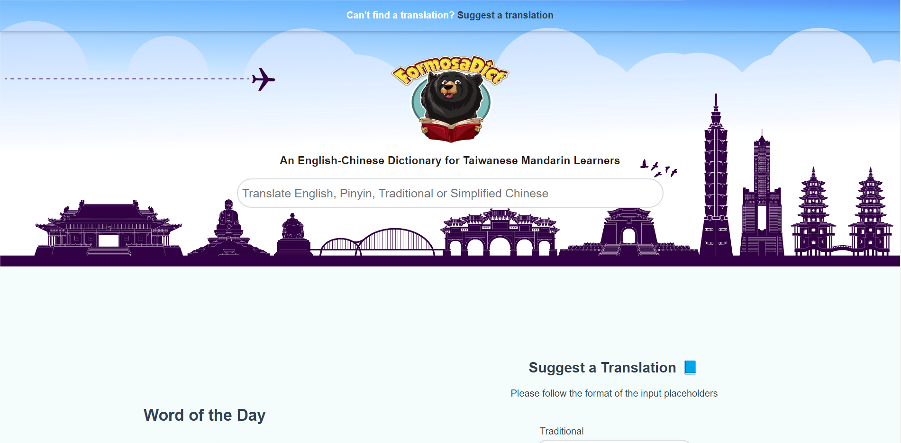

<h1>FormosaDict</h1>
</img>		    
<h2>Why This Exists</h2>
							      
FormosaDict is an English-Chinese dictionary catered towards people wanting to improve their Taiwanese Mandarin Chinese.
									 'Formosa' was Taiwan's former name and 'Dict' is short for dictionary. The bear in the logo reading a dictionary
									 is a 'Formosan Black Bear'.
								  

								  

									 As an expat in Taiwan, I (and many other expats) have often experienced frustrations when trying to learn the
									 local language due to their being an absense of many colloquialisms used in Taiwan in the other English-Chinese
									 dictionaries (<a href="https://www.pleco.com/">Pleco</a> & <a href="https://www.mdbg.net/chinese/dictionary">MDGB</a>). 
								  

								  
On top of this, it's often not clear when certain words are only used in China but not Taiwan. I 
									personally have wasted a lot of time memorising words that are exclusive to China when I'm only really 
									 interested in communicating with the locals in Taiwan. So, although the available dictionaries are 
									 fantastic and work great for Taiwanese Mandarin learners a lot of the time, they are often misleading. This is why I deemed it valuable to create FormosaDict.
									

                  <h2>Problems It Solves</h2>
									
FormosaDict aims to solve the problems I mentioned in the following ways - 

									<ul>
										<li>Many of the words and idioms that I come across that are native to Taiwan but are not listed
											on my dictionary or any of the others will be added by myself.
										</li>
										<li>
											Users can take the liberty to suggest a translation themselves for me to review through the
											'Suggest a Translation' form. 
										</li>
										<li>
											Chinese words listed in the dictionary that are exclusively used in Taiwan are accompanied
											with a bubble tea emoji and the initials 'TW' for extra clarity. Listed words that are 
											exclusive to China are accompanied with a panda
											emoji and the initials 'CH' (for political reasons, flag emojis are unavailable for Windows users).
										</li>
										  
										</img>
									</ul>
									<h3>Other Advantages</h3>
									<ul>
										<li>As fast and comprehensive as Pleco is, it doesn't run on the web, this clearly does.</li>
										<li>As FormosaDict is an SPA (Single-Page Application) it runs many times faster than MDGB. It
											also has a much more modern and minimalistic UI/UX.
										</li>
									</ul>